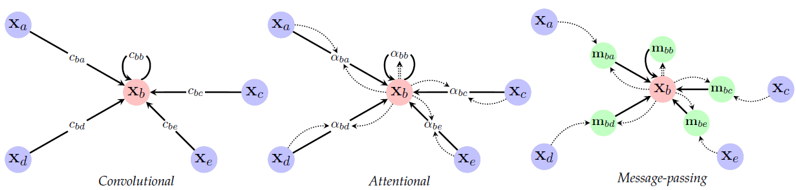

### GNN (Graph Neural Networks)

In-depth books and papers rerlated to Deep Graph Learning:
#### References
<ol>
<li>
Borsboom, D., et al. (2021). Network analysis of multivariate data in psychological science, Nature Reviews Methods Primers 1, 57.
</li>
<li>
Henry, T.R., Robinaugh, D.J. & Fried, E.I. (2021). On the control of psychological networks, Psychometrika.
</li>  
<li>
  Stankovic, L. (2018), Vertex-Frequency Analysis of Graph Signals, Springer.
</li>
<li>
  Ma, Y., and Tang, J. (2021), Deep Learning on Graphs, Cambridge University Press.
</li> 
<li>
  Spielman, D.A. (2019). Spectral and Algebraic Graph Theory, http://cs-www.cs.yale.edu/homes/spielman/sagt/sagt.pdf .
</li>  
<li>
  Hamilton, W. L. (2020). Graph Representation Learning, Morgan & Claypool.
</li>  
<li>
  Higham, N. J. (2008), Functions of Matrices: Theory and Computation, SIAM.
</li>
<li>
  Stevens, E., Antiga, L., Viehmann, T. (2020). Deep Learning with PyTorch,  Manning.
</li> 
<li>
Ruiz, L., Gama, F.,  Ribeiro, A. (2021). Graph neural networks: architectures, stability, and transferability, arXiv:2008.01767 (Proceedings of the IEEE).
</li>
<li>
  Bronstein, M.M., Bruna, J., Cohen, T & Veličković, P (2021). Geometric Deep Learning: Grids, Groups, Graphs, Geodesics, and Gauges, arXiv:2104.13478.
</li>  
<li>
  F. Scarselli, et al. (2009), The Graph Neural Network Model, IEEE Transactions on Neural Networks.
</li>
<li>
  Z. Wu, et al. (2019), A Comprehensive Survey on Graph Neural Networks, arXiv:1901.00596.
</li>
<li>
  V. P. Dwivedi, et al. (2020), Benchmarking Graph Neural Networks, arXiv:2003.00982.
</li>
<li>
  J. Zhou, et al. (2018), Graph Neural Networks: A Review of Methods and Applications, arXiv:1812.08434.
</li>
</ol>
