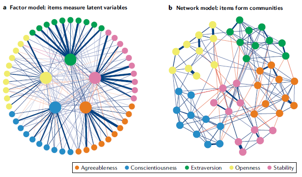

### GNN (Graph Neural Networks)

#### References
<ol>
<li>
L. Ruiz, F. Gama and A. Ribeiro, "Graph Neural Networks: Architectures, Stability, and Transferability," in Proceedings of the IEEE, vol. 109, no. 5, pp. 660-682, May 2021, doi: 10.1109/JPROC.2021.3055400.
</li>
<li>
Borsboom, D., et al. (2021). Network analysis of multivariate data in psychological science, Nature Reviews Methods Primers 1, 57.
</li>
<li>
Henry, T.R., Robinaugh, D.J. & Fried, E.I. (2021). On the control of psychological networks, Psychometrika.
</li>  
</ol>

