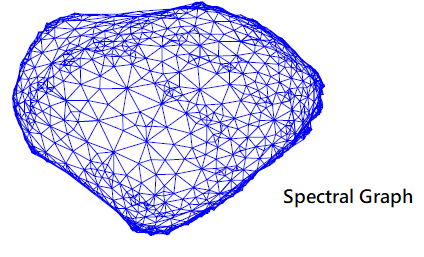

### GNN (Graph Neural Networks)

#### References
<ol>
<li>
L. Ruiz, F. Gama and A. Ribeiro, "Graph Neural Networks: Architectures, Stability, and Transferability," in Proceedings of the IEEE, vol. 109, no. 5, pp. 660-682, May 2021, doi: 10.1109/JPROC.2021.3055400.
</li>
<li>
Borsboom, D., et al. (2021). Network analysis of multivariate data in psychological science, Nature Reviews Methods Primers 1, 57.
</li>
<li>
Henry, T.R., Robinaugh, D.J. & Fried, E.I. (2021). On the control of psychological networks, Psychometrika.
</li>  
<li>
  Bronstein, M.M., Bruna, J., Cohen, T & Veličković, P (2021), Geometric Deep Learning: Grids, Groups, Graphs, Geodesics, and Gauges, arXiv:2104.13478.
</li>  
<li>
  Spielman, D.A. (2019), Spectral and Algebraic Graph Theory, http://cs-www.cs.yale.edu/homes/spielman/sagt/sagt.pdf .
</li>  
<li>
  Hamilton, W. L. (2020), Graph Representation Learning, Morgan & Claypool.
</li>  
<li>
  Stevens, E., Antiga, L., Viehmann, T. (2020), Deep Learning with PyTorch,  Manning.
</li> 
</ol>

